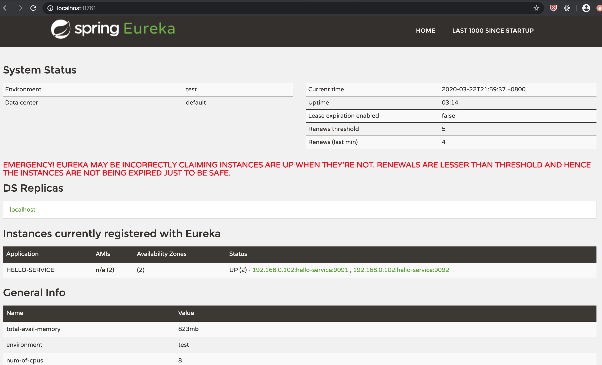
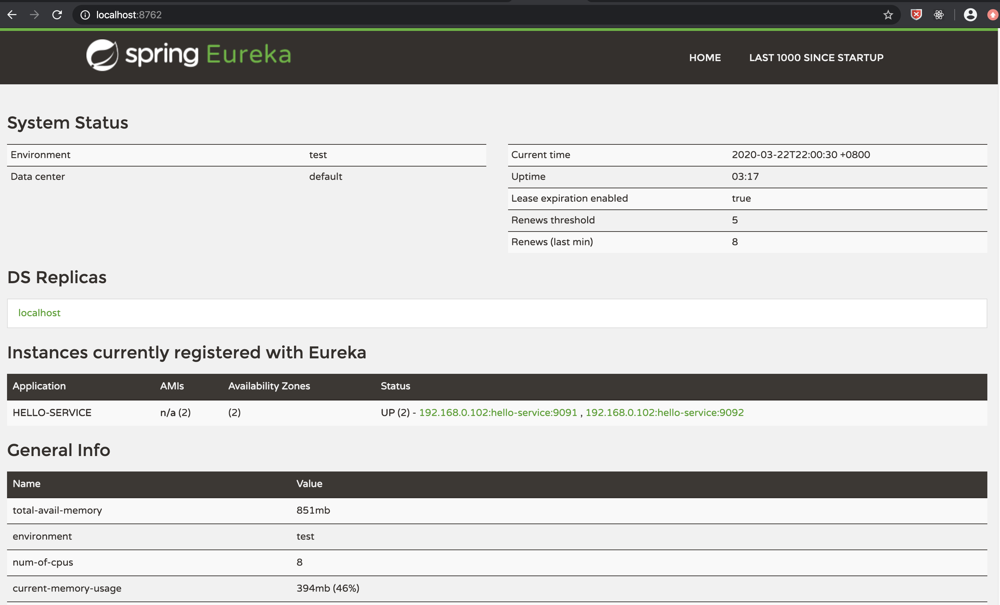
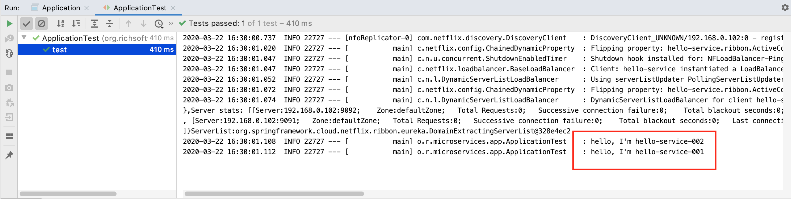

# Spring Cloud 微服务架构

## 服务注册与发现（Eureka）

Spring Cloud 的服务注册与发现是基于 ***Eureka*** 组件实现的，下面我们来写个demo实现该功能。总体架构很简单，详见下图。


### 创建 maven 父工程（microservices）

利用 [Spring Initializr](https://start.spring.io/) 来帮我们生成必要的 maven 依赖，我们不在父工程内编写任何代码，故将src目录删除之。
同时调整pom文件，配置如下：

```xml
<?xml version="1.0" encoding="UTF-8"?>
<project xmlns="http://maven.apache.org/POM/4.0.0" xmlns:xsi="http://www.w3.org/2001/XMLSchema-instance"
         xsi:schemaLocation="http://maven.apache.org/POM/4.0.0 https://maven.apache.org/xsd/maven-4.0.0.xsd">
    <modules>
        <module>service-registry</module>
        <module>hello-service</module>
        <module>hello-app</module>
    </modules>    
    <modelVersion>4.0.0</modelVersion>

    <parent>
        <groupId>org.springframework.boot</groupId>
        <artifactId>spring-boot-starter-parent</artifactId>
        <version>2.2.5.RELEASE</version>
        <relativePath/> <!-- lookup parent from repository -->
    </parent>

    <groupId>org.richsoftware</groupId>
    <artifactId>microservices</artifactId>
    <version>0.0.1-SNAPSHOT</version>
    <name>microservices</name>
    <description>Demo project for Spring Boot</description>
    <packaging>pom</packaging>

    <properties>
        <java.version>1.8</java.version>
        <spring-cloud.version>Hoxton.SR3</spring-cloud.version>
    </properties>

    <dependencies>
        <dependency>
            <groupId>org.springframework.boot</groupId>
            <artifactId>spring-boot-devtools</artifactId>
            <scope>runtime</scope>
            <optional>true</optional>
        </dependency>

        <dependency>
            <groupId>junit</groupId>
            <artifactId>junit</artifactId>
            <scope>test</scope>
        </dependency>

        <dependency>
            <groupId>org.springframework.boot</groupId>
            <artifactId>spring-boot-starter-test</artifactId>
            <scope>test</scope>
            <exclusions>
                <exclusion>
                    <groupId>org.junit.vintage</groupId>
                    <artifactId>junit-vintage-engine</artifactId>
                </exclusion>
            </exclusions>
        </dependency>
    </dependencies>

    <dependencyManagement>
        <dependencies>
            <dependency>
                <groupId>org.springframework.cloud</groupId>
                <artifactId>spring-cloud-dependencies</artifactId>
                <version>${spring-cloud.version}</version>
                <type>pom</type>
                <scope>import</scope>
            </dependency>
        </dependencies>
    </dependencyManagement>

    <build>
        <plugins>
            <plugin>
                <groupId>org.springframework.boot</groupId>
                <artifactId>spring-boot-maven-plugin</artifactId>
            </plugin>
        </plugins>
    </build>

</project>

```

### 创建注册中心工程（service-registry）

注册中心（Eureka-Server），提供服务注册与发现的能力，是 Eureka 的服务端。
基于高可用原则，下面我们也会启动两个实例用于测试，故编写了两套不同的配置。

-   pom 文件配置
```xml
<?xml version="1.0" encoding="UTF-8"?>
<project xmlns="http://maven.apache.org/POM/4.0.0"
         xmlns:xsi="http://www.w3.org/2001/XMLSchema-instance"
         xsi:schemaLocation="http://maven.apache.org/POM/4.0.0 http://maven.apache.org/xsd/maven-4.0.0.xsd">
    <parent>
        <artifactId>microservices</artifactId>
        <groupId>org.richsoftware</groupId>
        <version>0.0.1-SNAPSHOT</version>
    </parent>
    <modelVersion>4.0.0</modelVersion>

    <artifactId>service-registry</artifactId>

    <dependencies>
        <dependency>
            <groupId>org.springframework.cloud</groupId>
            <artifactId>spring-cloud-starter-netflix-eureka-server</artifactId>
        </dependency>
    </dependencies>
</project>
```

-   Application 入口程序，跟以往不同的是需要加上注解：@EnableEurekaServer
```java
package org.richsoftware.microservices.registry;

import org.springframework.boot.SpringApplication;
import org.springframework.boot.autoconfigure.SpringBootApplication;
import org.springframework.cloud.netflix.eureka.server.EnableEurekaServer;

@SpringBootApplication
@EnableEurekaServer
public class Application {
    public static void main(String[] args) {
        SpringApplication.run(Application.class, args);
    }
}

```

-   application.yml 通用配置

```YAML
spring:
  application:
    name: service-registry

eureka:
  server:
    enable-self-preservation: true
  client:
    fetch-registry: false
    register-with-eureka: false
    service-url:
      defaultZone: http://localhost:8761/eureka,http://localhost:8762/eureka
```
-   application-001.yml 第一个实例配置

```YAML
server:
  port: 8761
```
-   application-002.yml 第二个实例配置

```YAML
server:
  port: 8762
```

### 创建基础服务工程（hello-service）

基础服务组件，提供HTTP服务接口，是 Eureka 的客户端，将自己注册给注册中心。
基于高扩展性原则，下面我们启动两个实例用于测试服务发现的负载均衡。

-   pom 文件配置

```xml
<?xml version="1.0" encoding="UTF-8"?>
<project xmlns="http://maven.apache.org/POM/4.0.0"
         xmlns:xsi="http://www.w3.org/2001/XMLSchema-instance"
         xsi:schemaLocation="http://maven.apache.org/POM/4.0.0 http://maven.apache.org/xsd/maven-4.0.0.xsd">
    <parent>
        <artifactId>microservices</artifactId>
        <groupId>org.richsoftware</groupId>
        <version>0.0.1-SNAPSHOT</version>
    </parent>
    <modelVersion>4.0.0</modelVersion>

    <artifactId>hello-service</artifactId>

    <dependencies>
        <dependency>
            <groupId>org.springframework.cloud</groupId>
            <artifactId>spring-cloud-starter-netflix-eureka-client</artifactId>
        </dependency>

        <dependency>
            <groupId>org.springframework.boot</groupId>
            <artifactId>spring-boot-starter-web</artifactId>
        </dependency>
    </dependencies>
</project>
```

-   Application 入口程序

```java
package org.richsoftware.microservices.service;

import org.springframework.boot.SpringApplication;
import org.springframework.boot.autoconfigure.SpringBootApplication;

@SpringBootApplication
public class Application {
    public static void main(String[] args) {
        SpringApplication.run(Application.class, args);
    }
}
```

-   HelloController ，我们加入一个配置变量，以便请求时知道是调用了哪个服务实例

```java
package org.richsoftware.microservices.service.controller;

import org.springframework.beans.factory.annotation.Value;
import org.springframework.web.bind.annotation.GetMapping;
import org.springframework.web.bind.annotation.RestController;

@RestController
public class HelloController {
    @Value("${instanceName}")
    private String instanceName;

    @GetMapping("/hello")
    public String hello() {
        return "hello, I'm " + instanceName;
    }
}
```

-   application.yml，设置 spring.application.name: hello-service，这个是服务发现里面的服务名

```yaml
spring:
  application:
    name: hello-service

eureka:
  client:
    service-url:
      defaultZone: http://localhost:8761/eureka, http://localhost:8762/eureka

instanceName: hello-service
```

-   application-001.yml，监听 9091 端口，并设置实例名称为：hello-service-001

```yaml
server:
  port: 9091

instanceName: hello-service-001
```

-   application-002.yml，监听 9092 端口，并设置实例名称为：hello-service-002

```yaml
server:
  port: 9092

instanceName: hello-service-002
```

### 创建服务调用工程（hello-app）

服务调用方也是 Eureka 的客户端，如果不提供服务，可以不需要将自己注册给注册中心。

-   pom 文件配置

```xml
<?xml version="1.0" encoding="UTF-8"?>
<project xmlns="http://maven.apache.org/POM/4.0.0"
         xmlns:xsi="http://www.w3.org/2001/XMLSchema-instance"
         xsi:schemaLocation="http://maven.apache.org/POM/4.0.0 http://maven.apache.org/xsd/maven-4.0.0.xsd">
    <parent>
        <artifactId>microservices</artifactId>
        <groupId>org.richsoftware</groupId>
        <version>0.0.1-SNAPSHOT</version>
    </parent>
    <modelVersion>4.0.0</modelVersion>

    <artifactId>hello-app</artifactId>

    <dependencies>
        <dependency>
            <groupId>org.springframework.cloud</groupId>
            <artifactId>spring-cloud-starter-netflix-eureka-client</artifactId>
        </dependency>

        <dependency>
            <groupId>org.springframework.boot</groupId>
            <artifactId>spring-boot-starter-web</artifactId>
        </dependency>
    </dependencies>
</project>
```

-   Application 程序入口，作为 HTTP 调用方，我们使用了 RestTemplate 实例，并配置了 @Bean、@LoadBalanced 等注解

```java
package org.richsoftware.microservices.app;

import org.springframework.boot.SpringApplication;
import org.springframework.boot.autoconfigure.SpringBootApplication;
import org.springframework.cloud.client.loadbalancer.LoadBalanced;
import org.springframework.context.annotation.Bean;
import org.springframework.web.client.RestTemplate;

@SpringBootApplication
public class Application {
    public static void main(String[] args) {
        SpringApplication.run(Application.class, args);
    }

    @Bean
    @LoadBalanced
    public RestTemplate restTemplate() {
        return new RestTemplate();
    }
}

```

-   单元测试入口，跟以往不同的是，我们请求的服务地址已不再是真实的地址，而是服务名地址：http://hello-service/hello

```java
package org.richsoftware.microservices.app;

import org.junit.Test;
import org.junit.runner.RunWith;
import org.slf4j.Logger;
import org.slf4j.LoggerFactory;
import org.springframework.beans.factory.annotation.Autowired;
import org.springframework.boot.test.context.SpringBootTest;
import org.springframework.test.context.junit4.SpringRunner;
import org.springframework.web.client.RestTemplate;

@RunWith(SpringRunner.class)
@SpringBootTest(webEnvironment = SpringBootTest.WebEnvironment.RANDOM_PORT)
public class ApplicationTest {
    public static final Logger LOGGER = LoggerFactory.getLogger(ApplicationTest.class);
    @Autowired
    RestTemplate restTemplate;

    @Test
    public void test() {
        String result1 = restTemplate.getForObject("http://hello-service/hello", String.class);
        LOGGER.info(result1);
        String result2 = restTemplate.getForObject("http://hello-service/hello", String.class);
        LOGGER.info(result2);
    }
}

```

### 打包程序

-   进入 microservices 工程所在的根目录，执行 maven 命令，如下 

```shell script
mvn install 
```

### 启动 service-registry 两个实例

```shell script
java -jar service-registry-1-0.0.1-SNAPSHOT.jar --spring.profiles.active=001
```

```shell script
java -jar service-registry-1-0.0.1-SNAPSHOT.jar --spring.profiles.active=002
```

### 启动 hello-service 两个实例

```shell script
java -jar hello-service-0.0.1-SNAPSHOT.jar --spring.profiles.active=001
```

```shell script
java -jar hello-service-0.0.1-SNAPSHOT.jar --spring.profiles.active=002
```
---




---

从以上两个注册中心的控制台都可以看出，hello-service 两个实例都成功注册给了两个注册中心。

### 启动 hello-app 测试程序

由于是单元测试程序，我们直接在 IDE 中启动该程序



从结果中我们看到，客户端请求成功，并且两次调用分别请求到了不同的服务实例，实现了负载均衡。

### 总结

Spring Cloud 的服务注册与发现组件开箱即用，我们只需要通过简单配置便可以轻松实现该功能，完整的代码工程在下面。

[github完整代码](https://github.com/Richealfan/microservices)