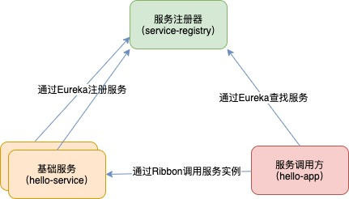
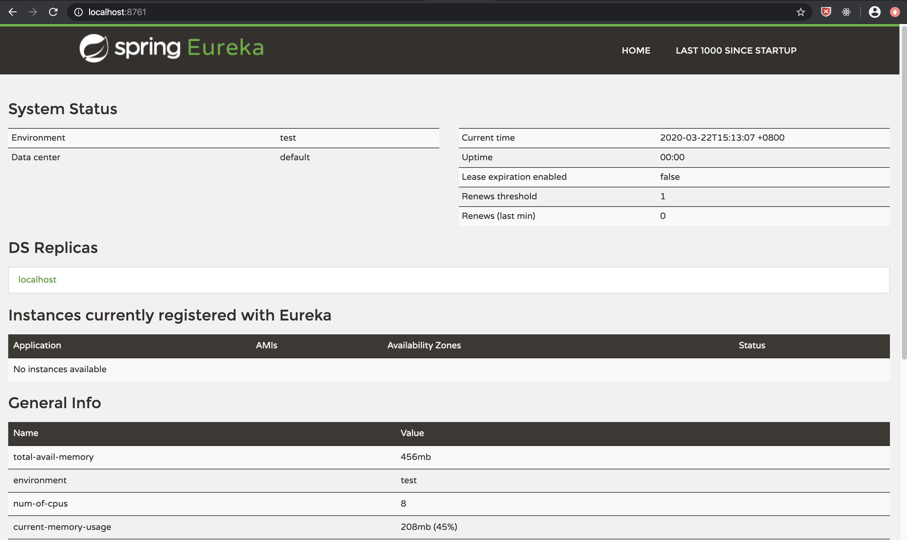

# Spring Cloud 微服务架构

## 服务注册与发现（Eureka）

今天我们来看看 Spring Cloud 的服务注册与发现组件：Eureka。总体架构很简单，详见下图。
这里边主要涉及三个角色的组件，一个注册中心组件，一个基础服务组件以及一个服务调用组件，下面我们通过实例来看看实现的过程。
本着高可用，可扩展的原则，我把其中两个组件分别创建了两个工程，方便在开发过程进行调试。



###  注册中心组件

-   service-registry

这个组件，相当于一张服务注册表，提供服务注册与发现的能力。
主要的 spring cloud 依赖如下：

```xml
<dependency>
    <groupId>org.springframework.cloud</groupId>
    <artifactId>spring-cloud-starter-netflix-eureka-server</artifactId>
</dependency>
```



### 基础服务组件
    
-   hello-service

### 服务调用组件

-   hello-app
